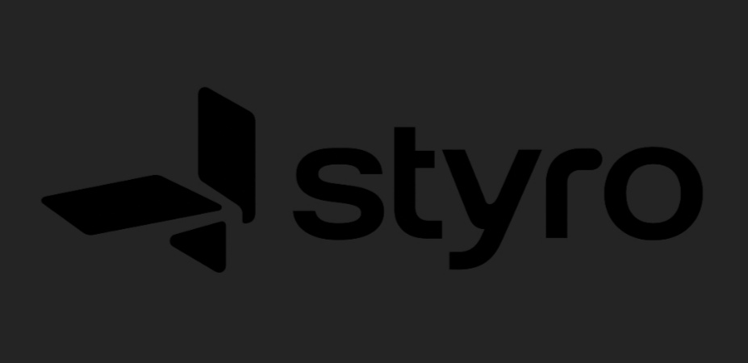

# Styro

<p align="center">
  
</p>

> Your phone, arranged around you.

[](https://github.com/Voidwalker-28/Styro/releases/latest)
[](https://github.com/Voidwalker-28/Styro/releases/latest)
[](https://expo.dev)
[](https://www.typescriptlang.org)

Styro is a calm, futuristic launcher-style experience for Android — free forever, with no accounts, no paywalls, no ads, and no tracking. It rethinks the home screen around *you*: a quiet surface for what matters, deep control when you want it, and nothing shouting for attention.

**[⬇ Download the latest APK](https://github.com/Voidwalker-28/Styro/releases/latest)**

## Why Styro exists

Most launchers are either noisy billboards or sterile grids. Styro takes a third path: a home screen that feels designed rather than decorated — glanceable widgets, a calm favorites rail, and an App Space that gets out of your way. Every pixel earns its place.

## Features

| | |
|---|---|
| **Calm home surface** | A quiet vertical favorites rail, glanceable widget cards, zero noise |
| **App Space** | Full app list with live search, categories, and an alphabet index |
| **Folders** | Group apps into folders with a clean overlay |
| **Widget stacks** | Stack widget cards and flip through them on the home surface |
| **Gesture editor** | Customize gestures your way |
| **Deep Customize screen** | Grids, per-surface settings, themes, composition preview |
| **Backup export / import** | Your entire setup travels with you as a file |
| **Adaptive layouts** | Intentional compositions for phones and tablets, portrait and landscape |

## Screenshots

> Screenshots live in [`docs/screenshots/`](docs/screenshots/) — home surface, App Space, folders, widget stacks, and Customize.

## Get started

```bash
npm install
npx expo start
```

Then press `a` (Android), `i` (iOS simulator, macOS), or `w` (web preview).

To build the release APK yourself:

```bash
./scripts/build-apk.sh
```

See [`docs/BUILD.md`](docs/BUILD.md) for the full toolchain, signing, and release process.

## Tech stack

- **Expo** (React Native + TypeScript + expo-router) — one codebase, native feel
- **AsyncStorage** — local-first persistence, your data never leaves the device
- **Custom design system** — original signal mark, geometric app icons, design tokens in `src/lib/`

## Project structure

```
src/
├── app/          # Routes: onboarding, home (index), drawer (App Space),
│                 # customize, native-capabilities
├── components/   # Original Styro UI: icons, rails, folders, widget cards,
│                 # stacks, sheets, settings rows
├── lib/          # Design tokens, demo catalog, breakpoints, persistence,
│                 # global search — store.tsx is the single source of truth
└── hooks/        # Thin selectors over the store
scripts/
├── build-apk.sh            # One-command release APK builder
└── release-notes-v1.0.0.md # Notes for the first preview release
docs/
└── BUILD.md      # Toolchain, offline build, signing, release process
```

## Honest boundary

This repo ships the **preview build**: a fully interactive simulation of the Styro launcher. Anything that needs real Android system APIs — default launcher role, installed-app discovery, notification access, wallpaper reading, real widgets — is clearly labeled *Preview simulation only* or *Requires native Android integration* inside the app. Styro never fakes a system action.

## Accessibility

Screen-reader announcements, 44pt touch targets, keyboard shortcuts on web (`/` search, `Esc` back), reduced-motion support, and large-text scaling.

## Contributing

Ideas, issues, and pull requests are welcome. Open an issue first for anything large so we can talk it through.

## License

Original code and artwork in this repo are Styro's own. Fictional demo apps use original names and geometric marks — no third-party branding.
